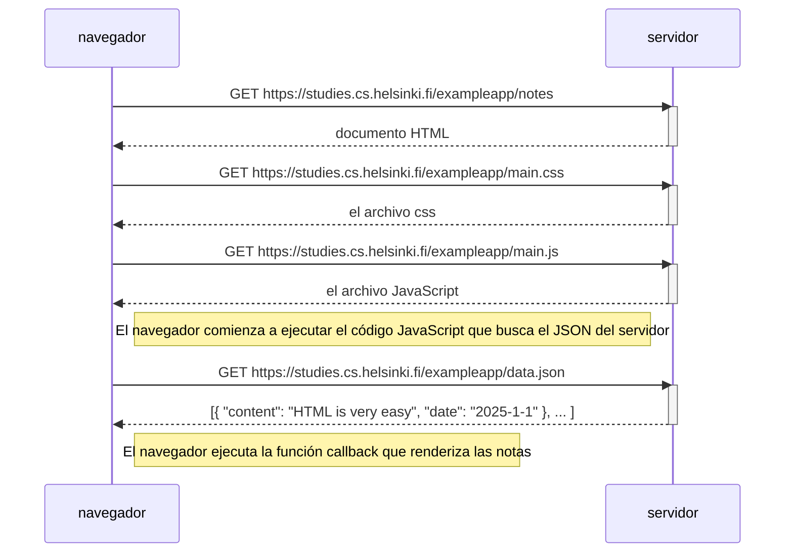

# app diagram

```mermaid
sequenceDiagram
    participant navegador
    participant servidor

    navegador->>servidor: GET https://studies.cs.helsinki.fi/exampleapp/notes
    activate servidor
    servidor-->>navegador: documento HTML
    deactivate servidor

    navegador->>servidor: GET https://studies.cs.helsinki.fi/exampleapp/main.css
    activate servidor
    servidor-->>navegador: el archivo css
    deactivate servidor

    navegador->>servidor: GET https://studies.cs.helsinki.fi/exampleapp/main.js
    activate servidor
    servidor-->>navegador: el archivo JavaScript
    deactivate servidor

    Note right of navegador: El navegador comienza a ejecutar el código JavaScript que busca el JSON del servidor

    navegador->>servidor: GET https://studies.cs.helsinki.fi/exampleapp/data.json
    activate servidor
    servidor-->>navegador: [{ "content": "HTML is very easy", "date": "2025-1-1" }, ... ]
    deactivate servidor

    Note right of navegador: El navegador ejecuta la función callback que renderiza las notas
```
